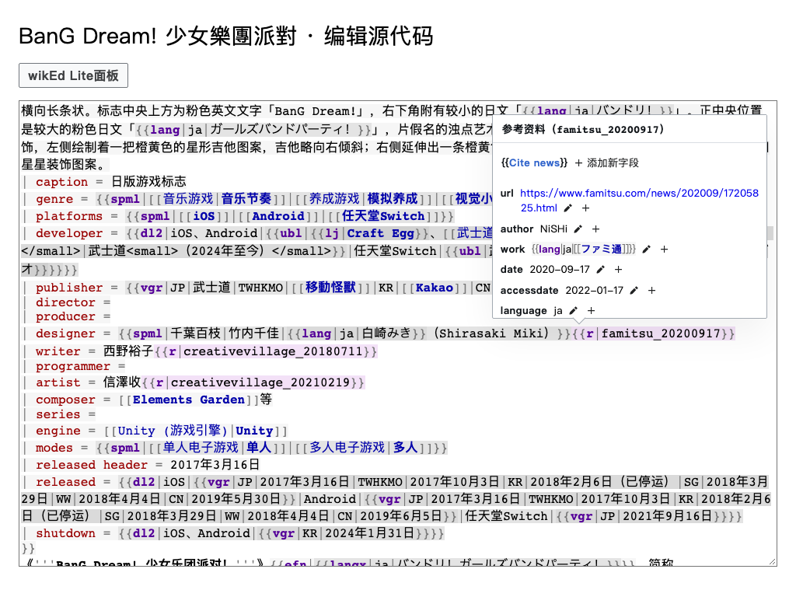

# wikEd Lite

[English](README.md) · [繁體中文](README.zh-Hant.md) · [简体中文](README.zh-Hans.md)

在 MediaWiki 编辑页面实时高亮、检查及整理维基文本。

<!-- toc:start -->

## 目录

- [功能](#功能)
- [安装](#安装)
- [使用方法](#使用方法)
- [截图](#截图)
- [帮助与反馈](#帮助与反馈)
- [许可](#许可)

<!-- toc:end -->

## 功能

- 实时语法高亮，可选择显示参考资料与页面预览。
- 直接在参考资料浮窗中检查和修改引文字段。
- 整理选中范围或整页文本，可选择对齐模板参数和解析重定向。
- 所有修改立即同步至 MediaWiki 提交的源代码。

## 安装

选择一种安装方式：

1. **MediaWiki：**下载 GitHub 最新版本的 [wiked_lite.min.js](https://github.com/For-Each-Next/wp-wiked-lite/releases/latest/download/wiked_lite.min.js)，将内容复制到该站的 `Special:MyPage/common.js`。管理员也可安装为小工具。
2. **Tampermonkey：**安装 [wiked_lite.user.js](https://github.com/For-Each-Next/wp-wiked-lite/releases/latest/download/wiked_lite.user.js)，其中包含可阅读的代码与用户脚本标头。

安装后重新加载编辑页面。移除时，从 common.js 删除相应代码或禁用用户脚本。设置保存在当前浏览器的当前维基站点。

## 使用方法

1. 在条目选择**编辑源代码**。
2. 从页面工具打开 **wikEd Lite 面板**。
3. 选择整理选项或高亮设置，再用主要操作按钮应用到本次编辑。
4. 选择**更多 → 保存设置**，供以后使用。
5. 检查源代码后，再使用 MediaWiki 的发布操作。

面板整理维基文本，不会发布编辑。可选的页面查询需要网络连接。支持当前的浏览器与 Wikimedia ResourceLoader API。非维基文本的内容模型可在设置中启用网站提供的 CodeMirror 编辑器。

## 截图

使用运行中的工具及 [BanG Dream! 条目第 94028176 版](https://zh.wikipedia.org/w/index.php?oldid=94028176)截取。这些是离线示例；来源与署名见[截图说明](docs/screenshots.md)。

## 帮助与反馈

详见[设置](docs/configuration.md)与[面板操作](docs/control-panel.md)。遇到问题时可在 [GitHub issues](https://github.com/For-Each-Next/wp-wiked-lite/issues) 提供浏览器、维基站点及复现步骤。开发说明见[贡献指南](CONTRIBUTING.md)。

## 许可

基于 [Cacycle 的 wikEd](https://en.wikipedia.org/wiki/User:Cacycle/wikEd)，实时高亮也受到 [Remember the dot](https://www.mediawiki.org/wiki/User:Remember_the_dot/Syntax_highlighter) 启发。项目自身材料使用 [CC0 1.0](LICENSE)，Codex 图标保留 MIT 许可，详见[第三方声明](THIRD-PARTY-NOTICES.md)。维基百科测试文本保留 CC BY-SA 4.0 署名。
