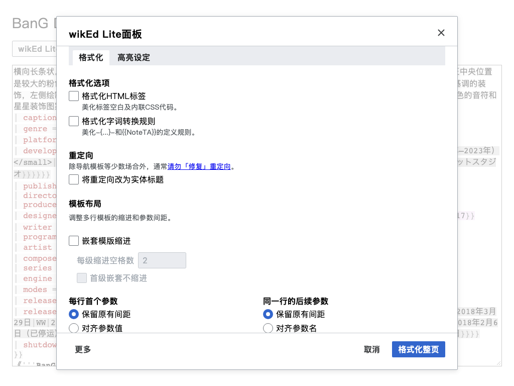
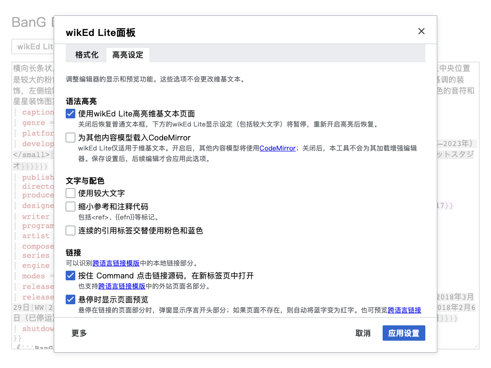

# Control panel design

**UI changes must follow [Wikimedia Codex: types and order of buttons](https://doc.wikimedia.org/codex/latest/style-guide/using-links-and-buttons.html#types-and-order-of-buttons).**
Use one primary progressive action per group, normal secondary actions, quiet
tertiary actions, and neutral cancellation. Forward flows place the primary
action last in reading and keyboard order; stacked groups place it first.
Keep dialog actions at the inline end with 12px spacing, and separate irreversible
destructive actions from progressive actions. Use inline Codex messages for
actionable errors, accessible progress for pending work, and native MediaWiki
notifications for brief success feedback.

The panel uses the wiki's Vue and Wikimedia Codex components, with framed tabs
and a small scoped stylesheet for spacing and layout. It does not bundle a separate UI
framework or fetch design assets. The following official guidance informed
the redesign; the implementation uses the project's locked Codex version for
local verification.

| Area                  | Implementation                                                                                                                                                                                                | Official guidance                                                                                                                                                                         |
| --------------------- | ------------------------------------------------------------------------------------------------------------------------------------------------------------------------------------------------------------- | ----------------------------------------------------------------------------------------------------------------------------------------------------------------------------------------- |
| Information structure | Highlighting settings contains presentation and previews; Formatting combines cleanup, redirects, and template layout. These are independent topics, not sequential steps.                                    | [Tabs](https://doc.wikimedia.org/codex/latest/components/demos/tabs.html)                                                                                                                 |
| Dialog actions        | One progressive primary action, a quiet neutral Cancel action, and a close button. The primary label identifies the formatting scope or applies settings without formatting.                                  | [Dialog](https://doc.wikimedia.org/codex/latest/components/demos/dialog.html), [Using links and buttons](https://doc.wikimedia.org/codex/latest/style-guide/using-links-and-buttons.html) |
| Occasional actions    | A quiet More menu groups Save settings, Clear cache, and destructive Reset settings. Success uses native notifications; errors and progress remain in the footer.                                             | [MenuButton](https://doc.wikimedia.org/codex/latest/components/demos/menu-button.html)                                                                                                    |
| Forms                 | Visible labels, semantic fieldsets, 24px section spacing, and 16px indentation for dependent controls. Related template fields stack below 640px.                                                             | [Constructing forms](https://doc.wikimedia.org/codex/latest/style-guide/constructing-forms.html)                                                                                          |
| Choices               | Checkboxes collect preferences for explicit submission. Conditional options retain their values when hidden. Alignment labels distinguish names from values, with a live example.                             | [Checkbox](https://doc.wikimedia.org/codex/latest/components/demos/checkbox.html), [Constructing forms](https://doc.wikimedia.org/codex/latest/style-guide/constructing-forms.html)       |
| Visual hierarchy      | Standard Codex controls and semantic skin tokens; quiet supporting text; a single primary action. The template example uses a flat surface without elevation.                                                 | [Colors](https://doc.wikimedia.org/codex/latest/style-guide/colors.html), [Typography](https://doc.wikimedia.org/codex/latest/style-guide/typography.html)                                |
| Wording               | Short sentence-case labels, explicit units, descriptive actions, complete translated sentences, and error messages that explain how to continue.                                                              | [Writing for copy](https://doc.wikimedia.org/codex/latest/style-guide/writing-for-copy.html), [Voice and tone](https://doc.wikimedia.org/codex/latest/style-guide/voice-and-tone.html)    |
| Accessibility         | Codex manages modal focus, tab keyboard navigation, control labels, and focus indicators. Errors and progress use accessible feedback components. Logical spacing supports RTL; example wikitext remains LTR. | [Accessibility](https://doc.wikimedia.org/codex/latest/style-guide/accessibility.html), [Bidirectionality](https://doc.wikimedia.org/codex/latest/style-guide/bidirectionality.html)      |

<!-- toc:start -->

## Contents

- [Interaction contract](#interaction-contract)
- [Verification](#verification)

<!-- toc:end -->

## Interaction contract

Both images use a 1024-pixel viewport width. Regenerate them with
`npm run screenshots`; see [screenshot fixtures](screenshots.md).

- Changes remain drafts until the primary action succeeds. Cancel, close, and
  Escape discard unapplied drafts. Applying Highlighting settings never invokes
  the formatter. Explicit Save settings and Clear cache actions are immediate;
  dismissing the panel does not undo them.
- Accepted settings remain available when reopening the panel in the same edit
  session. Persistence is optional and saves all tabs in browser-local storage.
- More → Save settings stores the current draft without formatting, applying it
  to the editor, or closing the panel. A storage failure leaves the draft open
  and does not prevent applying it for the current edit. Formatting failures
  likewise preserve the draft for retry.
- Saving settings and clearing the cache show brief native MediaWiki success
  notifications, with a visually hidden announcement inside the modal for screen
  readers. The dialog stays open, with errors and progress shown in its footer.
- More → Reset settings removes the saved configuration and restores the whole
  dialog draft to defaults. Save and Reset always cover both tabs. Reset leaves
  the current editor unchanged until the defaults are applied. Its menu item
  uses Codex's destructive treatment; the close action is quiet and neutral.
- The source range and action are captured before asynchronous work. Busy
  controls cannot submit twice or dismiss the dialog during an operation.
- Network-backed features remain opt-in. Redirect lookup runs only on an
  explicit formatting action. Editor lookups run in the background after the
  settings are accepted.
- Highlighting settings has four groups: **Syntax highlighting**, **Text and
  colors**, **Links**, and **Reference popups**. The first group contains the
  wikEd Lite wikitext switch followed by the independent CodeMirror option for
  other content models. Text size and consecutive-reference colors share the
  second group. Link navigation, hover previews, and missing-page coloring appear
  in that order. Reference inspection, full-page source loading, editing, and
  lightweight editing appear in that order in the final group.
- Disabling wikEd Lite highlighting removes its editor frame and restores the
  native textarea. The three display groups, including larger text, are disabled
  while preserving their settings. Re-enabling highlighting restores the
  enhanced editor and those features using the current source. Older saved
  configurations keep highlighting enabled.
- Text and colors includes an opt-in alternating-colors setting. References start
  pink; consecutive groups alternate pink and blue backgrounds,
  preserving text colors. A run of three references appears pink, blue, then pink.
  A self-closing `<ref />` and its directly following reference template form one
  group. Standalone reference templates also alternate; prose resets the sequence.
  `{{Efn}}` and its supported variants use ordinary template shading while
  retaining the optional small reference text size. They do not count as reference
  color groups; consecutive references inside a note alternate from pink
  independently of references before the note.
- Reference tag inspection shows a subreference's `details` before its parent
  bibliography. Missing parent definitions do not hide those details; enabled
  whole-page reference loading can still resolve the parent from another section.
  Subreference content retains its raw wikitext with the editor's syntax
  highlighting, without template expansion.
- Article and reference previews point to the mouse position captured when the
  popup opens, including on wrapped links and references. Moving the mouse over
  the same source keeps the popup and arrow still. Popups flip above or below when
  needed, and their bodies and arrows stay inside the editor frame. Near an edge,
  the arrow points as close to the activation position as the frame allows.
- Displayed citation values and reference content use source syntax highlighting
  with the editor's palette instead of rendering the markup. Existing archive-URL
  abbreviation is retained. Link aliases are bold, and missing-link highlighting
  follows the editor setting.
- Ctrl-clicking a wiki link or external URL in the source display opens it in a
  new tab in both regular and lightweight modes.
- The tooltip's main heading is **Reference**, followed by a named reference's
  name in parentheses and styled as code. Unnamed references show only
  **Reference**. Localized text nodes surround the name, which is rendered as
  text inside a code element. **Sub-reference content**
  labels the local details when present. The citation template name then heads
  its parameter rows; content without a citation uses **Reference content**.
- In regular mode, reference tooltips place action icons after citation field
  values and edit icons after note content and subreference `details`. Browser tooltips
  name citation fields and distinguish editing reference content from editing
  subreference content. Paired person fields can be edited separately. The pencil
  opens citation parameter name and value inputs, with the value selected by
  default. Content editors use a textarea at least two lines high.
  Every edit and add form, in both regular and lightweight modes, has **Cancel**,
  **Reset**, and **Save** actions in that order. Regular forms use buttons.
  Save updates the source and supports Undo/Redo, while Cancel or Escape
  discards the draft.
  Save and Reset keep the inspection popup open and refresh its displayed
  content in both regular and lightweight modes.
  Citations that cannot be parsed into fields expose their raw text through
  **Edit reference content**. Inputs omit surrounding value whitespace;
  edits preserve the existing leading and trailing whitespace in the source.
  Action icons use the default text color and measure 0.85em, keeping them
  smaller than the tooltip text. Links retain the theme's link colors.
- **Enable editing while inspecting references** is enabled by default. Turning
  it off hides edit, add, and reset controls while keeping reference inspection
  available. It and **Read the full page source when editing a section** appear
  at the same level as **Reference tag inspection**. Both remain visible but
  disabled when inspection is off, retaining their values. Save settings
  persists them; Reset settings restores their defaults.
- **Use lightweight reference editing** is an optional child of the reference-editing setting,
  off by default. A plain-text **[✎]** control before **[+]** opens a citation parameter's
  name and value for editing together in their source display, with a shared
  background highlighting the whole edit group. Reference and subreference content
  also use the plain-text **[✎]** control. Lightweight edit controls use text characters,
  with no SVG or image. Double-clicking source text does not start editing.
  One set of plain **[×]**, **[↶]**, and **[✓]** controls follows the value for Cancel,
  Reset, and Save, followed by **[+]** for adding a blank field.
  Enter saves, Shift+Enter inserts a new line, and Escape cancels; this keyboard
  guidance appears in the panel's setting description. The preference remains
  visible and retains its value while disabled, becoming available when
  inspection and editing are both enabled. It is saved and reset with the other
  settings.
- The add control beside a citation parameter inserts a new field immediately
  after it, below it in multiline source. **Add a new field** sits alongside the
  citation template heading and inserts before the first existing parameter.
  Names must be valid and unused; duplicate fields and malformed wikitext values
  are rejected. Insertions follow the existing parameter layout. Saving a new
  field updates the source and supports Undo/Redo.
- Editing or adding citation fields automatically escapes bare pipes as `{{!}}`.
  Pipes inside nested templates, wikilinks, comments, and literal tags remain
  unchanged.
- Duplicate citation parameter names show a Codex alert icon in regular mode
  and the **⚠︎** character in lightweight mode, with a browser tooltip identifying
  the repeated name. Existing duplicate values remain visible and editable at
  their own source locations.
- Saved edits give only the changed parameter name or value a distinct
  background. Regular mode uses Codex's edit-undo icon in place of the edit icon.
  The Reset action has a browser tooltip showing the original value, which remains
  the baseline through repeated gadget edits. Reset restores that original
  value; for an already-added field, it removes the field. Both actions support
  Undo/Redo. Reset stays grey and unavailable when there is no saved change and
  the draft is unchanged; changing the draft name or value enables it.
  Unapplied drafts do not highlight fields.
- During section editing, edit and add controls for fields fetched from outside
  the current section are greyed out. Field names and values retain their normal
  appearance. The controls' browser tooltips explain why they are unavailable.
  A subreference's local `details` remain editable even when its parent reference
  comes from another section. Editing is also unavailable when a field cannot
  be located in the current source. The same
  restrictions apply to adding fields to a citation.
- Clear cache acts immediately on page summaries, missing-page results, and
  whole-page reference source. Pending responses from before the clear are
  ignored. It does not reset preferences or namespace metadata.
- Formatting options includes **Format HTML tags** on every wiki, off by default.
  It normalizes tag spacing, attribute quoting, and inline `style` CSS while
  protecting comments, literal contents, and ambiguous or dynamic syntax.
- **Format language conversion rules** covers inline `-{...}-` rules and
  page-wide manual `NoteTA` rules. It is available only on zhwiki; saved
  preferences cannot enable it on other wikis.
- Nested-template indentation has an explicit checkbox and a numeric spaces-per-level
  field, defaulting to 2 and accepting nonnegative whole numbers. Disabling
  indentation retains the width and first-level opt-out for later use.
- The Tracklists example contains two nested `tracklist` templates for Side A and
  Side B, each with Chinese and English track titles to demonstrate indentation.
  The longer `heading` and `comment` parameter names demonstrate alignment.
  Ratios are displayed as Latin:Chinese (3:5 and 1:2) and are available on every
  wiki, including enwiki. Existing stored formatter values retain their
  Chinese:Latin convention for compatibility.
- Examples and translated content render as text. Every source change still
  passes through the existing editor replacement path and native textarea.

## Verification

Reference tooltip surfaces, text, controls, state highlights, and warnings use
the host wiki's Codex color tokens with Codex fallback colors. Wikitext syntax
highlighting within reference tooltips retains the editor's syntax palette.

The compact tooltip icons use the official `cdxIconEdit`, `cdxIconEditUndo`,
`cdxIconAdd`, `cdxIconAlert`, and `cdxIconUndo` paths from the pinned `@wikimedia/codex-icons`
package. The build validates and injects only their path data and direction
metadata. The browser creates SVG elements directly, without loading an icon
runtime. Both generated artifacts retain the icons' full MIT notice; see
[third-party notices](../THIRD-PARTY-NOTICES.md).

Unit tests cover draft acceptance, dismissal, option preservation, asynchronous
snapshots, cache invalidation, and failure recovery. Offline browser tests mount
the actual Codex dialog and verify selected-range formatting, form submission,
focus restoration, keyboard tabs, menu actions, highlighting controls,
wiki-specific options, persistence, error presentation, RTL, and narrow layouts
in English, Simplified Chinese, and Traditional Chinese.
